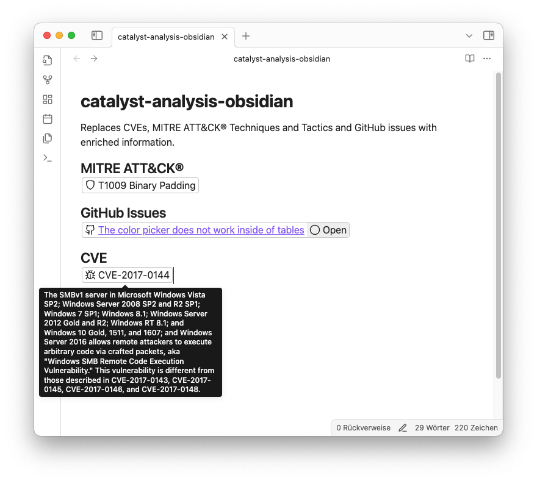

# Catalyst Analysis Obsidian Plugin

This [Obsidian](https://obsidian.md/) plugin connects to the [Catalyst Analysis](https://github.com/SecurityBrewery/catalyst-analysis) API to provide advanced security analysis features within Obsidian.

> [!WARNING]  
> **Experimental project:**
> The Catalyst Analysis Obsidian Plugin is an experimental project and needs to be installed manually. The plugin is not yet available in the Obsidian community plugins list.
> See [Build a plugin](https://docs.obsidian.md/Plugins/Getting+started/Build+a+plugin) for more information on how to install the plugin.

## Screenshots

